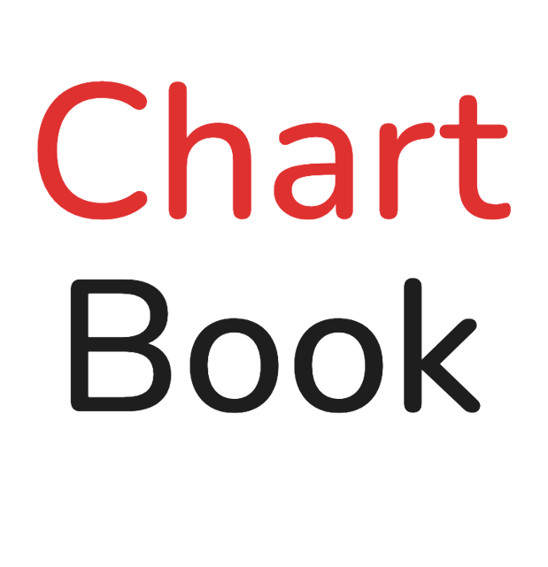

---
myst:
  html_meta:
    "description lang=en": |
      Introduction to ChartBook
html_theme.secondary_sidebar.remove: true
---

# ChartBook

<!--  -->

Last updated: {sub-ref}`today` 


::::{grid} 3

:::{grid-item-card}  📈 [Charts](charts.md)
:link: charts
:link-type: doc
Search among individual charts (chart book entries) or browse charts by topic, data source, or other categories. Download or export when you're ready.
:::

:::{grid-item-card} 📊 [Dataframes](dataframes.md)
:link: dataframes
:link-type: doc
Browse dataframes that are produced by each pipeline, the dataframes that power the individual charts.
:::

:::{grid-item-card}  🔌 [Pipelines](pipelines.md)
:link: pipelines
:link-type: doc
Browse the pipelines that power the generated dataframes and charts.
:::

:::{grid-item-card}  👋 [Contributing](contributing.md)
:link: contributing
:link-type: doc
Guide for contributing to the ChartBook. This includes adding or removing charts, or providing maintenance to frontend or pipeline code.
:::

::::

```{toctree}
:maxdepth: 2
:hidden:

charts.md
dataframes.md
pipelines.md
contributing.md
```
